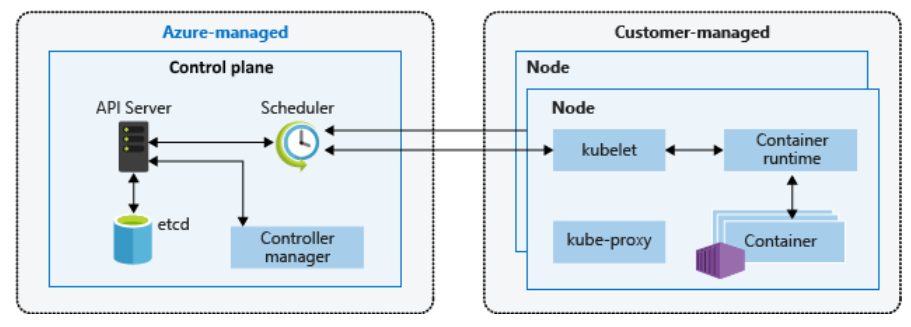

# Create AKS Cluster

## Step-01: Introduction
- Understand about AKS Cluster
- Discuss about Kubernetes Architecture from AKS Cluster perspective
- Azure Kubernetes Service (AKS) simplifies deploying a managed kubernetes cluster in Azure by offloading the opertaional overhead to Azure. As a hosted Kubernetes service, Azure handles critical tasks, like health monitoring and maintenance. When you create an AKS cluster, a control plan is automatically created and configured. This control plane is provided at no cost as a managed Azure resource abstracted from the user. You only pay for and manage the nodes attached to the AKS cluster.
- You can create an AKS cluster using Azure CLI, Azure PowerShell, Azure Portal, and ARM templates, Bicep, Terraform.

`
Kubernetes is a rapidly evolving platform that manages container-based applications and their associated networking and storage components.
`


`
A kubernetes cluster is divided into two components:
- _Control Plane_: prvides the core kubernetes service and orchestration of application workloads. The control panel includes the following core kubernetes components:
1. _kube-apiservice_: The API server is how the underlying Kubernetes APIs are exposed. This component provides the interaction for management tools, such as _kubectl_ or the kubernetes dashboard.
2. _etcd_: To maintain the state of your kubernetes cluster and configuration.
3. _Kube-scheduler_: It determines what nodes can run the workload and starts them.
4. _Kube_controller-Manager_: Oversees the smaller controllers that perform actions such as replicating pods and handling node operation.
- _Nodes_: runs the application workload
1. _Kubelet_: processes the orchestration requests from the control plane along with scheduling and running the requested containers.
2. _kube-proxy_: handles virtual networkingon each node.
3. _container runtime_: allows containerized application to run and interact with additional resources, such as the virtual network and storage 
`

## Step-02: Create AKS Cluster
- Create Kubernetes Cluster
- **Basics**
  - **Subscription:** Free Trial
  - **Resource Group:** Creat New: aks-rg1
  - **Kubernetes Cluster Name:** aksdemo1
  - **Region:** (US) Central US
  - **Kubernetes Version:** Select what ever is latest stable version
  - **Node Size:** Standard DS2 v2 (Default one)
  - **Node Count:** 1
- **Node Pools**
  - leave to defaults
- **Authentication**
  - Authentication method: 	System-assigned managed identity
  - Rest all leave to defaults
- **Networking**
  - **Network Configuration:** Advanced
  - **Network Policy:** Azure
  - Rest all leave to defaults
- **Integrations**
  - Azure Container Registry: None
  - leave to defaults
- **Tags**
  - leave to defaults
- **Review + Create**
  - Click on **Create**


## Step-03: Cloud Shell - Configure kubectl to connect to AKS Cluster
- Go to https://shell.azure.com
```
# Template
az aks get-credentials --resource-group <Resource-Group-Name> --name <Cluster-Name>

# Replace Resource Group & Cluster Name
az aks get-credentials --resource-group aks-rg1 --name aksdemo1

# List Kubernetes Worker Nodes
kubectl get nodes 
kubectl get nodes -o wide
```

## Step-04: Explore Cluster Control Plane and Workload inside that
```
# List Namespaces
kubectl get namespaces
kubectl get ns

# List Pods from all namespaces
kubectl get pods --all-namespaces

# List all k8s objects from Cluster Control plane
kubectl get all --all-namespaces
```

## Step-05: Explore the AKS cluster on Azure Management Console
- Explore the following features on high-level
- **Overview**
  - Activity Log
  - Access Control (IAM)
  - Security
  - Diagnose and solver problems
- **Settings**
  - Node Pools
  - Upgrade
  - Scale
  - Networking
  - DevSpaces
  - Deployment Center
  - Policies
- **Monitoring**
  - Insights
  - Alerts
  - Metrics
  - and many more 
- **VM Scale Sets**
  - Verify Azure VM Instances
  - Verify if **Enhanced Networking is enabled or not**  


## Step-06: Local Desktop - Install Azure CLI and Azure AKS CLI
```
# Install Azure CLI (MAC)
brew update && brew install azure-cli

# Login to Azure
az login

# Install Azure AKS CLI
az aks install-cli

# Configure Cluster Creds (kube config)
az aks get-credentials --resource-group aks-rg1 --name aksdemo1

# List AKS Nodes
kubectl get nodes 
kubectl get nodes -o wide
```
- **Reference Documentation Links**
- https://docs.microsoft.com/en-us/cli/azure/?view=azure-cli-latest
- https://docs.microsoft.com/en-us/cli/azure/aks?view=azure-cli-latest

## Step-07: Deploy Sample Application and Test
- Don't worry about what is present in these two files for now. 
- By the time we complete **Kubernetes Fundamentals** sections, you will be an expert in writing Kubernetes manifest in YAML.
- For now just focus on result. 
```
# Deploy Application
kubectl apply -f kube-manifests/

# Verify Pods
kubectl get pods

# Verify Deployment
kubectl get deployment

# Verify Service (Make a note of external ip)
kubectl get service

# Access Application
http://<External-IP-from-get-service-output>
```

## Step-07: Clean-Up
```
# Delete Applications
kubectl delete -f kube-manifests/
```

## References
- https://docs.microsoft.com/en-us/cli/azure/install-azure-cli-macos?view=azure-cli-latest

## Why Managed Identity when creating Cluster?
- https://docs.microsoft.com/en-us/azure/aks/use-managed-identity